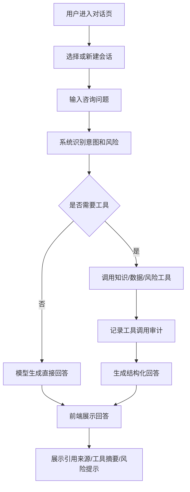
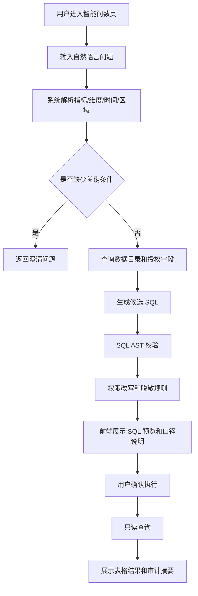
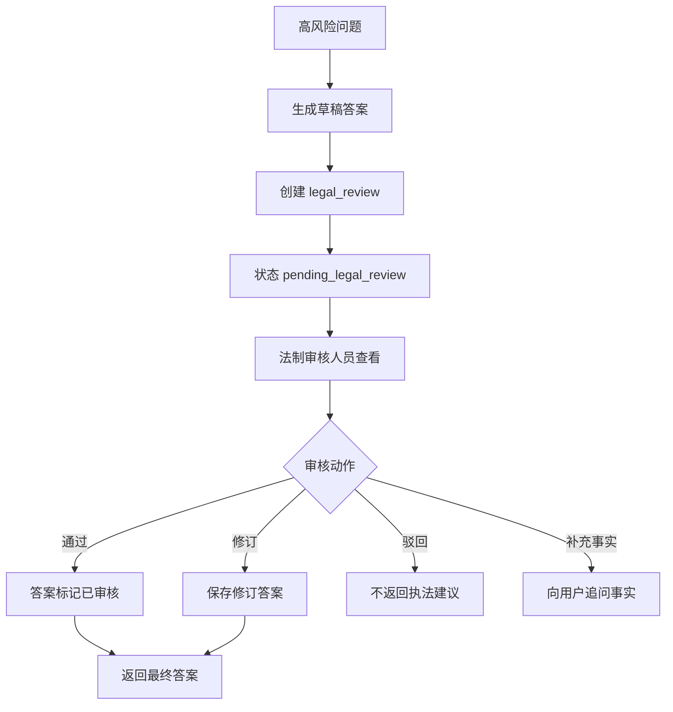

# 用户流程文档

## 1. 智能体对话流程

适用用户：一线执法人员、窗口/热线人员、科室管理人员。

关键交互：

- 用户可以继续追问，系统继承当前会话上下文。
- 流式输出过程中可点击取消。
- 答案必须展示引用来源和风险提示。
- 工具失败时展示明确失败原因，不展示系统堆栈。

## 2. 政策法规咨询流程

1. 用户输入政策或法规问题。
2. 系统识别为政策咨询、法规咨询或高风险法律问题。
3. 系统调用 `knowledge_search` 或 `law_clause_search`。
4. 检索时按文档状态过滤，默认排除草稿、过期和废止文件。
5. 如发现多版本或口径冲突，系统提示冲突来源。
6. 系统生成答案，包含结论摘要、适用条件、操作建议、引用依据和风险提示。
7. 用户可追问“依据是哪一条”，系统返回具体条款或章节。

异常流程：

- 无有效来源：系统提示未检索到权威依据，不输出确定结论。
- 命中废止文件：系统提示该文件不可作为当前依据。
- 高风险问题：进入事实追问或法制审核流程。

## 3. 业务咨询流程

1. 用户输入业务流程问题。
2. 系统识别事项类型和用户角色。
3. 系统检索业务知识库和标准答复模板。
4. 系统根据角色生成口径：
   - 窗口/热线人员：面向群众的解释话术。
   - 一线执法人员：操作步骤、责任边界、系统入口。
   - 管理人员：流程摘要、责任科室、办理时限。
5. 前端展示答案、来源、适用范围和更新时间。

异常流程：

- 事项缺少材料或时限配置：系统明确提示知识库不完整。
- 用户问题跨多个事项：系统先澄清事项。

## 4. 智能问数流程

关键交互：

- `preview` 阶段不执行 SQL。
- `execute` 前必须展示 SQL 摘要、统计口径、授权范围和风险提示。
- 查询结果默认限制行数。
- 普通用户查询全市明细时拒绝或改写为授权区域。

异常流程：

- 指标歧义：系统询问指标口径。
- 时间范围缺失：系统询问时间范围，低风险统计可默认本月并说明。
- SQL 校验失败：展示拒绝原因和修改建议。
- 查询超时：提示缩小时间范围或维度。

## 5. 综合分析流程

1. 用户在对话页输入复杂任务。
2. 系统判断为综合分析，创建计划。
3. 前端展示计划步骤：
   - 确认数据口径。
   - 查询业务数据。
   - 统计和发现异常。
   - 检索政策法规或业务知识。
   - 生成分析报告。
4. 每个步骤执行时推送 `plan.updated`。
5. 高风险或跨权限步骤触发确认或审核。
6. 最终输出报告，包含关键发现、数据证据、政策依据、建议措施和限制说明。

异常流程：

- 用户取消：计划状态变为 `cancelled`，后续工具不再执行。
- 工具失败：计划步骤变为 `failed`，用户可重试或结束。
- 服务重启：恢复未完成任务的可查询状态，不重复已完成步骤。

## 6. 知识文档流程

1. 管理员进入知识文档页。
2. 上传文档并填写元数据：标题、发文机关、文号、生效日期、失效日期、适用区域、主题标签、密级。
3. 文档状态为 `draft`。
4. 管理员触发索引。
5. 后端解析、分块、向量化并写入 pgvector。
6. 成功后状态为 `active`；失败后状态为 `failed`。
7. 管理员可执行废止、失效、重新索引。

异常流程：

- 解析失败：展示失败原因，允许重新上传。
- 缺少关键元数据：不允许发布为 `active`。
- 重复文档：提示可能重复，不阻断管理员处理。

## 7. 法制审核流程

审核记录必须保留审核人、审核时间、修改内容、适用范围和有效期。

## 8. 审计查看流程

1. 审计人员进入审计简表页。
2. 查看最近 AgentRun、ToolCall、QueryRecord、RiskEvent。
3. 可按时间、用户、风险等级、工具名筛选。
4. 点击记录查看请求摘要、工具参数摘要、结果摘要和错误原因。

审计页面不展示完整敏感字段，不展示系统提示词和模型密钥。

